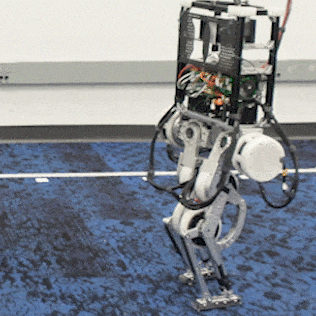
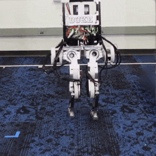

# Biped controller code

<table>
<tr>
<td></td>
<td></td>
</tr>
</table>

## Project structure

```bash

├── build                 # Compiled binaries and build artifacts
│   ├── ethercat_motor_py.cpython-38-x86_64-linux-gnu.so  # Compiled Python extension
│   ├── simple_test
│   └── ...
├── checkpoint            # RL model checkpoints
│   ├── baseline
│   └── ...
├── setup                   
│   └── conda_env.yaml    # conda env configuration file
├── CMakeLists.txt        # CMake build configuration file
├── ext                   # External dependencies and libraries
│   └── SOEM              # EtherCAT master library
├── biped_controller.py   # Main entrance for biped controller
├── motor_controller.py   # motor controller and initialization code
├── sensor_controller.py  # Sensor communication with teensy
├── trajectory_PD_test.py # Trajectory PD test script
├── gampad.py             # gamepad control script
├── numpy_ringbuffer.py   # Ring buffer implementation using NumPy
├── publisher.py          # Message publishing/receiving utility
├── README.md  
├── src                        # C++ source code directory
│   ├── ethercat_motor.h       # EtherCAT motor control header
│   ├── ethercat_motor_py.cpp  # Python binding for EtherCAT motor control
│   ├── pybind_test.cpp        # Pybind test implementation
│   ├── Readme.md              # Source code README file
│   └── simple_test.cpp        # Simple test implementation
├── sshkeyboard_pd_test.py     # SSH keyboard PD test script
└──  teensy_comm
    └── teensy_comm.ino        # Teensy communication Arduino code

```
The hardware and sim2real documentation are available at our [project wiki](https://www.notion.so/Duke-Humanoid-V1-b-38d54de887d1403a82f2367490c45b89)

## Setting up

### Tested environment
- Operating system: Ubuntu 22.04 with CUDA 12.3
- Development environment: Visual Studio Code (VSCode)
- C++ build tools:
  -  vcpkg (package manager)
  - CMake (build system generator)
  - GCC 12 (compiler)
- Python environment management: micromanba

### Setup python virtual environment
 first [install Micromamba](https://mamba.readthedocs.io/en/latest/installation/micromamba-installation.html) if you have not done so. Recommended to install at `~/repo/micromamba`


```bash
"${SHELL}" <(curl -L micro.mamba.pm/install.sh)
```

Setup a python virtual envirnpoment named  `py38` with conda yaml file `setup/conda_env.yaml` 

```bash
alias conda="micromamba"

# Create environment
conda env create --file setup/conda_env_py38.yaml -y

# Activate the environment
conda activate py38

# Export library path
export LD_LIBRARY_PATH=${CONDA_PREFIX}/lib
```


### Setup vcpkg

follow the instructions to install vcpkg: 
https://learn.microsoft.com/en-us/vcpkg/get_started/get-started?pivots=shell-bash

```bash
git clone https://github.com/microsoft/vcpkg.git
cd vcpkg && ./bootstrap-vcpkg.sh
./vcpkg install msgpack eigen3 iir1

```

Set vcpkg environment variables:
```bash
export VCPKG_ROOT=/path/to/vcpkg
export PATH=$VCPKG_ROOT:$PATH
```


### Build the c++ code

Create the build directory and navigate to it.

For example:
- the python virtual environment is `~/repo/micromamba/envs/py38`
- the python executatble is `~/repo/micromamba/envs/py38/bin/python`
- the vcpkg tool chain file is `~/repo/vcpkg/scripts/buildsystems/vcpkg.cmake`

change these variables to your actual variable to run the following:

```bash
mkdir build
cd build
cmake .. -DCMAKE_BUILD_TYPE=Debug -DCMAKE_PREFIX_PATH=~/repo/micromamba/envs/py38 -DPython_EXECUTABLE=~/repo/micromamba/envs/py38/bin/python -DCMAKE_TOOLCHAIN_FILE=~/repo/vcpkg/scripts/buildsystems/vcpkg.cmake -G Ninja
```

## setup python environment


### Setup vscode
Install VSCode: [Download and install](https://code.visualstudio.com/download) vscode if you have not done so

Install vscode Extensions:
- C/C++: ms-vscode.cpptools
- CMake Tools: ms-vscode.cmake-tools
- Python: ms-python.python
Optionally Install other extensions such as Git based on your needs.

To configure the project using vscode:
- Open the project folder.
- Ensure C/C++ uses GCC 12.
- Select the correct Python virtual environment.
- Configure CMake Tools if needed, You should replace [.vscode/c_cpp_properties.json](.vscode/c_cpp_properties.json) to point to your Python path:
```
  "includePath": [
      "${workspaceFolder}/**",
      "${workspaceFolder}/ext/SOEM/soem",
      // replace those to point to your python include
      "${env:HOME}/repo/micromamba/envs/py38/include/**",
      "${env:HOME}/repo/micromamba/envs/py38/include"
 ],
```
 Also replace [.vscode/settings.json](.vscode/settings.json) to poin to your python path
```
  "cmake.configureSettings": {
      // replace to your path
      "CMAKE_PREFIX_PATH": "${env:HOME}/repo/micromamba/envs/py38",
      "Python_EXECUTABLE": "${env:HOME}/repo/micromamba/envs/py38/bin/python",
      "CMAKE_TOOLCHAIN_FILE":"${env:HOME}/repo/vcpkg/scripts/buildsystems/vcpkg.cmake",
 },
```

### Build the Arduino code

setup arduino + Teensyduino
- Install the Arduino IDE from https://www.arduino.cc/en/software
- Install Teensyduino from https://www.pjrc.com/teensy/td_download.html
- Teensy Arduino usage can be found at https://www.pjrc.com/teensy/td_usage.html
- Install Adurino library: go to Sketch -> Include Library -> Manage Libraries..., In the search bar, type "TCA9548" and then "packetizer", and install.

Build the teensy code: in the Arduino IDE, open `teensy_comm/teensy_comm.ino` and upload.


## Run

### Initialization
First confirm the sensors are working
```bash
sudo chrt -f 99 $(which python) -u sensor_controller.py
```

Then, initialize the joint at the zero standing position. refer to wiki:[Joint initialization](https://www.notion.so/Joint-initialization-a068aad6d80e4ee8bc613af9ba50b854)
```bash
sudo chrt -f 99 $(which python) -u motor_controller.py

```
after the initalization you can choose either to run dynamic matching with the robot hanging,
or run the RL biped controller.


### Dynamic matching/Trajectory test 
```bash
sudo chrt -f 99 $(which python) -u trajectory_PD_test.py

```
in another terminal run keyboard control code
```bash
sudo chrt -f 99 $(which python) -u sshkeyboard_pd_test.py
```


### RL biped control
run biped control.
```
sudo chrt -f 99 $(which python) -u biped_controller.py
```
in another terminal run gampad
```
sudo chrt -f 99 $(which python) -u gampad.py
```

Note: 

For the gamepad, we use [8Bitdo Ultimate Controller](https://www.8bitdo.com/ultimate-bluetooth-controller/) with a 2.4g adapter. The gamepad code should work with any gampad that pygame supports with some modification. 